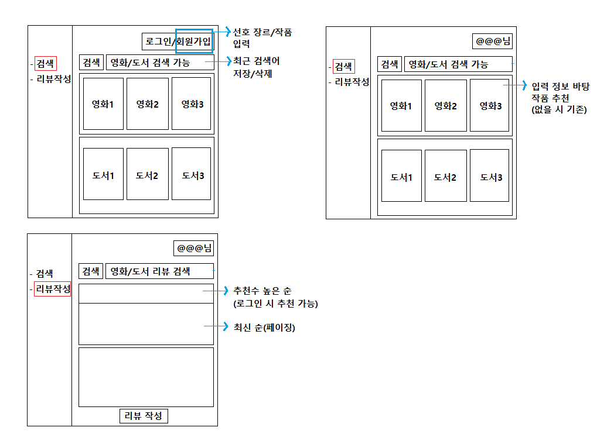
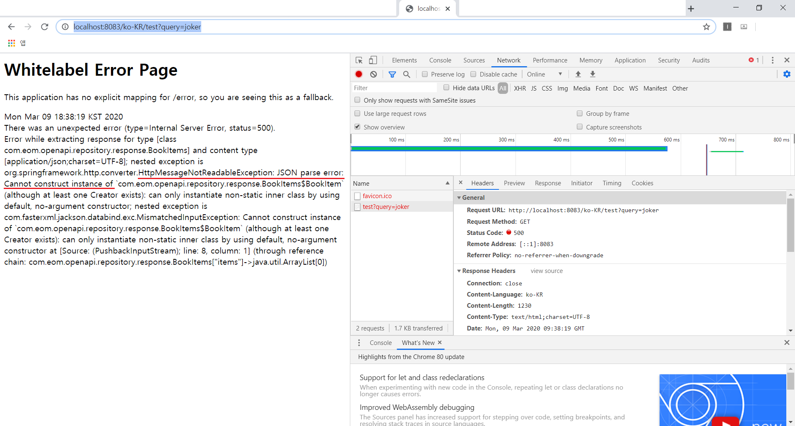

영화/도서 리뷰 사이트
=====
* ~~게시판에서 시작해 모듈(ex. 주문결제) 연동 목표~~
* 스프링 관련 게시물 [참고](https://github.com/nara1030/spring-basic)
- - -
## 목차
1. [Todo](#Todo)
2. [기록](#기록)
3. [참고](#참고)

## Todo
검색 및 리뷰 페이지로 구분된다.

1. 검색
	- [ ] 검색어 입력시 관련 3개 조회
	- [ ] 검색어 미입력시 연령별 3개 조회
	- [ ] 최근 검색어 표시
2. 리뷰
	- [ ] 검색
	- [ ] 게시글 CRUD
		- [ ] 검색 제외 로그인 필요
		- [ ] 10개 단위 페이징
		- [ ] 게시글 조회수
	- [ ] 글/댓글 추천
		- [ ] 상위 3개 상단 노출
	- [ ] 계층형 답글/댓글

- - -
 

* [v_2](./docs/v_2.md)
* v_3

##### [목차로 이동](#목차)

## 기록
* JSON parse error
	1. Cannot construct instance of  
		 
		* [이 게시물](https://brocess.tistory.com/150)과 같은 에러 발생
		* [jackson custom serializer/deserializer 만들기](https://multifrontgarden.tistory.com/172)
	2. Cannot deserialize value of type  
		 
* .

##### [목차로 이동](#목차)

## 참고
* [계층형 댓글 파일럿 프로젝트](https://zuminternet.github.io/ZUM-Pilot-ryudung/)
* [스프링 시큐리티 OAuth2 모듈을 이용한 카카오 로그인 연동하기](https://okky.kr/article/680363)
* [SSO와 세션](https://linuxism.ustd.ip.or.kr/1516)

##### [목차로 이동](#목차)
